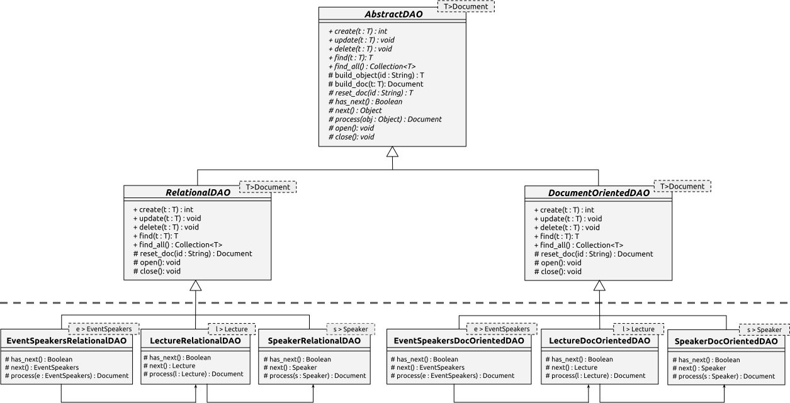
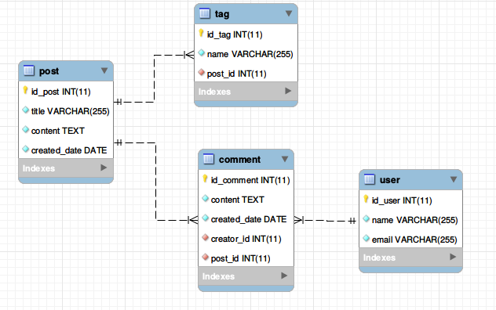

# A Mapping Framework for applications designed to handle documents

- [What is it?](#introduction)
- [Getting started](#getting-started)
	- [Model creation](#model-creation)
    - [Example](#example-model)
	- [Database creation](#database-creation)
    - [Example](#example-database)
	- [Mapping creation](#mapping-creation)
    - [Example](#example-mapping)
- [License](#license)

<a name="introduction"></a>
## What is it?

This is a framework designed to allow support both to relational and document oriented databases for applications designed to handle documents. By building it in the shape of an integration system, we manage to provide to applications seamless read and write access to databases that are able to store documents.

Following the specificed steps we will show next in the usage example section, applications that manipulate complex data will not be tightly coupled with D.O. databases (the general choose of document-oriented aplications) instead, the transition from one storage technology to another (e.g. from D.O. databases to databases based on the relational model of data) could be accomplished without maintenance effort in the application/model layers.

## Getting started 

First of all, it is important to know the basic architecture of this mapping framework. We developed its code in Java and it is essentially divided in two layers: model and persistence (see the figure below).

<p align="center">

</p>

Above the dotted line we isolate the generic behavior of the persistence logic to store and to manipulate documents-based schema (representing the model layer). In this context, the AbstractDAO class acts like an interface, providing the signatures of the CRUD operations accessible by the application layer. The another DAOs classes are responsible to establish the communication with the databases, using the resources of each specific  API (in this example we have used MySQL and MongoDB connectors).

Last but no least, below the dotted line, we have the DAO classes which are context-dependent of the schema to be mapped. That are the classes that need to be encoded by you, developer, to be consistent with the model layer. Next. we will show a simple example of how this could be done.

### Usage

#### Model Creation

In the [model layer](src/main/java/model), create a hierarchy of classes to represent the schema you want to persist. The classes need to extend '[Document](src/main/java/database/Document.java)'. This inheritance, ensures that only objects that are subtypes of 'Document' can be handled by the framework. This restriction allows type inferences to be effectively and seamlessly controlled.

Note that there must be a single root class of your schema. So, be careful and make sure that all your classes are properly structured.

<a name="example-model"></a>
+ Example

Regard a simple context of a blog with Users, Posts, Tags, and Comments, we could create the following classes:

``` java
	public class User extends Document {
		
		private int id; // necessary to SGBDRs
		private String name;
		private String email;
		
		/* constructors, getters and setters, ... */
		
	}
```

``` java
	public class Comment extends Document {
		
		private int id; // necessary to SGBDRs
		private String content;
		private Date createdDate;
		private User creator;
		
		/* constructors, getters and setters, ... */
		
	}
```

``` java
	public class Tag extends Document {
		
		private String id; // necessary to SGBDRs
		private String name;
		
		/* constructors, getters and setters, ... */
		
	}
```

``` java
	public class Post extends Document {
		
		private String id; // necessary both to D.O. databases and SGBDRs
		private String title;
		private String content;
		private Date createdDate;
		private Collection<Tag> tags;
		private Collection<Comment> comments;
		
		/* constructors, getters and setters, ... */
		
	}
```

This example schema meets the conditions required by the framework: every class extends 'Document' and there a single root object from which all information can be accessed ('Post'). 

#### Database Creation

Create the relational database that corresponds to the structure of the document type to be supported. As for the D.O. databases like MongoDB, no actions are required, since documents are schemaless.

In the relational database it is important to ensure that only the root table will not be referenced by foreign key. From this table, a record that forms the highest level of an document can be obtained. Additionally, all tables have a single foreign key, which assures a tree formation.

<a name="example-database"></a>
+ Example

Below you can see a Entity-Relationship Diagram of the model previously showed.

<p align="center">

</p>

This example database schema meets the conditions required by the framework: from the table 'Post' you can access all the other tables that structure the document.

#### Mapping Creation

In the [persistence layer](src/main/java/model/dao), create one concrete DAO class per class model, making it extend '[RelationalDAO](src/main/java/database/relational/RelationalDAO.java)' or '[DocumentOrientedDAO](src/main/java/database/docoriented/DocumentOrientedDAO.java)'.

After that, it is necessary override the 'next()' and 'process()' methods in each DAO class, and in case of the DAO of the root class it is also necessary to override the method 'has_next()'.

The next() method should move the cursor to the next object of the given document, 'process(obj)' sjould transform a specific object into a part of the document, and 'has_next()' should return true if the given document contains another object to be read, which means that its cursor can iterate further to return more objects. 

<a name="example-mapping"></a>
+ Example

The mplementation of 'next' and 'process' methods in a sub-class class could be seen, as a basis example, in [relational](src/main/java/model/dao/relational/mysql/SpeakerRelationalDAO.java) and [document oriented](src/main/java/model/dao/docoriented/mongodb/SpeakerDocOrientedDAO.java).

Lastly, the mplementation of 'next', 'process', and 'has_next' methods in a root class could be seen, as a basis example, in [relational](src/main/java/model/dao/relational/mysql/EventSpeakersRelationalDAO.java) and [document oriented](src/main/java/model/dao/docoriented/mongodb/EventSpeakersDocOrientedDAO.java).


## License

This framework is open-sourced software licensed under the [MIT license](LICENSE).
